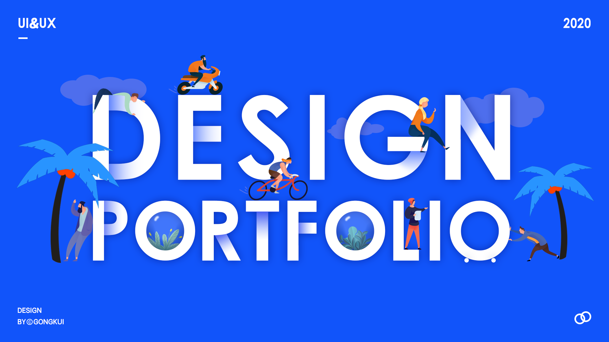

<!DOCTYPE html>
<html lang="en">
<head>
    <meta charset="UTF-8">
    <meta name="viewport" content="width=device-width, initial-scale=1.0">
    <title>2021年度个人作品集</title>
</head>

<body>
    

        
    

    
</body>
</html>
